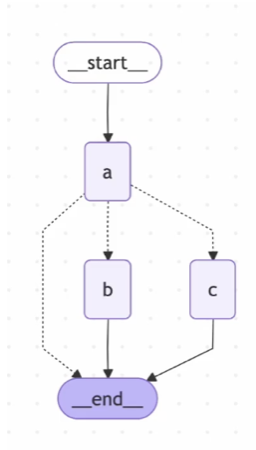
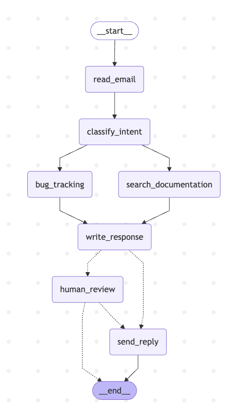

# LangGraph Academy Tutorial — AI Agents

This project is based on tutorials from the LangChain Academy course *Quickstart: LangGraph Essentials — Python*, with additional modifications and improvements made for learning purposes. 

It contains two example implementations:

- `human_in_the_loop.py` → Minimal state machine demonstrating interrupts and memory
- `email_support.py` → Multi-step AI agent with LLM-based classification, parallel processing, and human-in-the-loop approval.

---

## Overview

This repository demonstrates how to build AI agents using LangGraph, focusing on:

- State-driven workflows
- Conditional routing
- Parallel execution
- Human-in-the-loop approvals
- Persistent memory via thread IDs

---

## Project Structure

```text
langgraph_academy_tut/
│
├── human_in_the_loop.py    # Interrupt & memory demo
├── email_support.py        # LLM-based email support agent
├── requirements.txt
├── images/                 # For readme display
│   ├── hitl_flow.png
│   └── email_flow.png
├── .env                    # Local environent variables (not committed)
└── README.md
```
---

## Human-in-the-Loop Demo (`human_in_the_loop.py`)



A simplified example showing:

- State updates using reducers
- Node-controlled routing (`Command`)
- Interrupt and resume pattern
- Memory persistence across turns

This version does **not use an LLM**, making it easier to understand core LangGraph concepts.

---

## Email Support Agent (`email_support.py`)



Simulates a real-world agentic customer support workflow.

### Flow

1. Read incoming email
2. Classify intent and urgency using an LLM
3. Run in parallel:
   - Search documentation (mocked)
   - Create bug ticket (mocked)
4. Generate response using the LLM
5. Decide:
   - Send automatically
   - OR request human approval

### Features

- Structured LLM output (`TypedDict`)
- Parallel execution (fan-out / fan-in)
- Human-in-the-loop (`interrupt()` + `resume`)
- Batch processing with queued approvals
- Persistent state using `thread_id`

---

## Environment variables

The following environment variables are required:

```env
OPENAI_API_KEY=your_api_key_here
OPENAI_MODEL=gpt-5-mini
```

Optional LangSmith tracing:

```env
LANGSMITH_TRACING=true
LANGSMITH_API_KEY=your_api_key_here
LANGSMITH_PROJECT="your_project_name"
```


